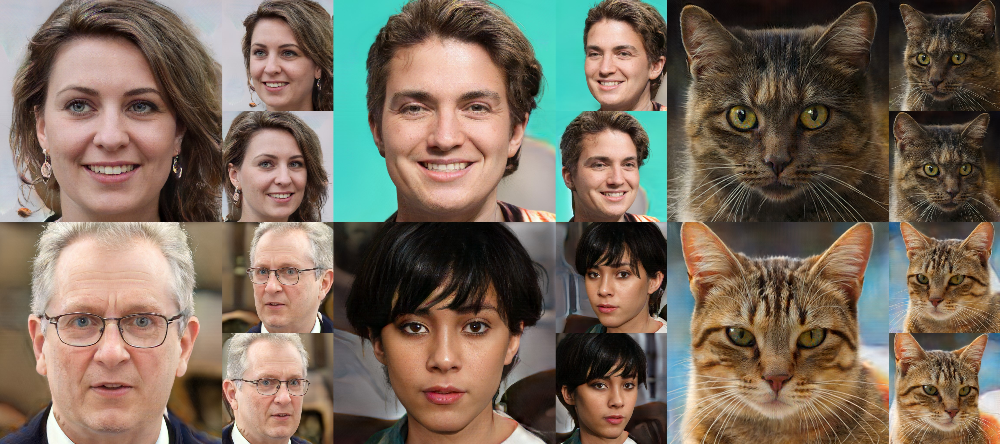

<h1 align="center">GRAM-HD: 3D-Consistent Image Generation at High Resolution with Generative Radiance Manifolds</h1>
<h5 align="center"><a href="https://jeffreyxiang.github.io">Jianfeng Xiang</a><sup>1,2</sup>&emsp;<a href="https://jlyang.org">Jiaolong Yang</a><sup>2</sup>&emsp;<a href="https://yudeng.github.io">Yu Deng</a><sup>1,2</sup>&emsp;<a href="https://www.microsoft.com/en-us/research/people/xtong/">Xin Tong</a><sup>2</sup></h5>
<h5 align="center"><sup>1</sup><a href="https://www.tsinghua.edu.cn/en/">Tsinghua University</a>&emsp;<sup>2</sup><a href="https://www.microsoft.com/en-us/research/lab/microsoft-research-asia/">Microsoft Research Asia</a></h5>
<p align="center"><b>ICCV 2023</b></h5>
<p align="center"></p>

**Abstract:** *Recent works have shown that 3D-aware GANs trained on unstructured single image collections can generate multiview images of novel instances. The key underpinnings to achieve this are a 3D radiance field generator and a volume rendering process. However, existing methods either cannot generate high-resolution images (e.g., up to 256X256) due to the high computation cost of neural volume rendering, or rely on 2D CNNs for image-space upsampling which jeopardizes the 3D consistency across different views. This paper proposes a novel 3D-aware GAN that can generate high resolution images (up to 1024X1024) while keeping strict 3D consistency as in volume rendering. Our motivation is to achieve super-resolution directly in the 3D space to preserve 3D consistency. We avoid the otherwise prohibitively-expensive computation cost by applying 2D convolutions on a set of 2D radiance manifolds defined in the recent generative radiance manifold (GRAM) approach, and apply dedicated loss functions for effective GAN training at high resolution. Experiments on FFHQ and AFHQv2 datasets show that our method can produce high-quality 3D-consistent results that significantly outperform existing methods.*

<h4><a href="https://jeffreyxiang.github.io/GRAM-HD/">Project Page</a> | <a href="https://arxiv.org/pdf/2206.07255.pdf">Paper</a> | <a href="https://arxiv.org/abs/2206.07255">ArXiv</a></h4>

## Requirements
- Currently only Linux is supported.
- 64-bit Python 3.8 installation or newer. We recommend Anaconda3.
- One or more high-end NVIDIA GPUs with NVIDIA drivers installed. Our code is tested with NVIDIA V100 and A100 GPUs.

## Installation
Clone the repository and setup the environment with all dependencies as follows:
```
git clone https://github.com/JeffreyXiang/GRAM-HD.git
cd GRAM-HD
conda env create -f environment.yml
conda activate gram-hd
```

## Pretrained Models
Pretrained models are stored within this repository. You can find them in the `ckpts` folder. The detailed description of the pretrained models is as follows:
| File | Description | Config |
| :-: | :-: | :-: |
| [ffhq256](https://github.com/JeffreyXiang/GRAM-HD/blob/main/ckpts/ffhq256.pt) | 256x256 model trained on FFHQ dataset | GRAMHD256_FFHQ
| [ffhq512](https://github.com/JeffreyXiang/GRAM-HD/blob/main/ckpts/ffhq512.pt) | 512x512 model trained on FFHQ dataset | GRAMHD512_FFHQ
| [ffhq1024](https://github.com/JeffreyXiang/GRAM-HD/blob/main/ckpts/ffhq1024.pt) | 1024x1024 model trained on FFHQ dataset | GRAMHD1024_FFHQ
| [afhqcats256](https://github.com/JeffreyXiang/GRAM-HD/blob/main/ckpts/afhqcats256.pt) | 256x256 model trained on AFHQ-Cats dataset | GRAMHD256_AFHQ
| [afhqcats512](https://github.com/JeffreyXiang/GRAM-HD/blob/main/ckpts/afhqcats512.pt) | 512x512 model trained on AFHQ-Cats dataset | GRAMHD512_AFHQ

## Inference
To generate multiview images or videos with our pretrained models, run the following command:
```
python inference.py

Options:
    --ckpt          Checkpoint file
    --output_dir    Output directory
    --config        Config file
    --seeds         Random seeds
    --type          Type of camera trajectory, one of ['video', 'multiview1x3', 'multiview3x7', 'rand']
    --truncation    GAN truncation factor

```

## Evaluation
First step is to sample images from the pretrained models with the following command:
```
python inference.py [--ckpt <ckpt>] [--output_dir <output_dir>] [--config <config>] --seeds 0-9999 --type rand --truncation 1.0
```
This will generate 10000 images with random seeds from 0 to 9999 under randomly sampled camera positions. You can adjust the number of samples by changing the `--seeds` option to your own needs.

Then, to evaluate the generated samples, run the following command:
```
python eval.py

Options:
    --real_images_dir          Real images directory
    --fake_images_dir          Fake images directory
    --tmp_dir                  Temporary directory
    --image_size               Image size
    --num_samples              Number of samples
    --real_images_cache_name   Real images cache name
    --fake_images_cache_name   Fake images cache name
    --use_real_images_cache    Use real images cache
    --use_fake_images_cache    Use fake images cache
```

## Training from Scratch
### Data Preparation
Please refer to [GRAM repository](https://github.com/microsoft/GRAM) for data preparation. The final precessed and aligned dataset should be stored in the following structure:
```
<dataset_name>
├── *.<image_extension>
├── ...
└── poses
    ├── *.<pose_extension>
    └── ...
```


### Training
To train the model, run the following command with the corresponding config file and the path to the prepared dataset:
```
python train.py

Options:
    --config           Config file
    --output_dir       Output directory
    --load_dir         Load directory
    --set_step         Which step to start training, default to latest
    --data_dir         Data directory
    --total_step       Total training steps
    --sample_interval  Sample interval
    --save_interval    Model save interval
    --port             Port for distributed training

Example:
    # 64x64 GRAM model trained on FFHQ dataset
    python train.py --config GRAM64_FFHQ --data_dir <path_to_ffhq_dataset> --output_dir <output_dir> --total_step 100000

    # 256x256 GRAMHD model trained on FFHQ dataset
    python train.py --config GRAMHD256_FFHQ --data_dir <path_to_ffhq_dataset> --output_dir <output_dir> --total_step 100000
```
The code will automatically detect all available GPUs and use DDP training. You can use the provided configs or add your own config.

Note that to train the GRAMHD model, you need to first train a GRAM model under low resolution (e.g., 64x64). Before training the GRAMHD model, don't forget to set the `gram_model_file` entry in the config file to the path of the pretrained GRAM model.

## Citation
If you find our work useful in your research, please consider citing:
```
@InProceedings{xiang2023gramhd,
    title     = {GRAM-HD: 3D-Consistent Image Generation at High Resolution with Generative Radiance Manifolds},
    author    = {Xiang, Jianfeng and Yang, Jiaolong and Deng, Yu and Tong, Xin},
    booktitle = {Proceedings of the IEEE/CVF International Conference on Computer Vision (ICCV)},
    month     = {October},
    year      = {2023},
    pages     = {2195-2205}
}
```